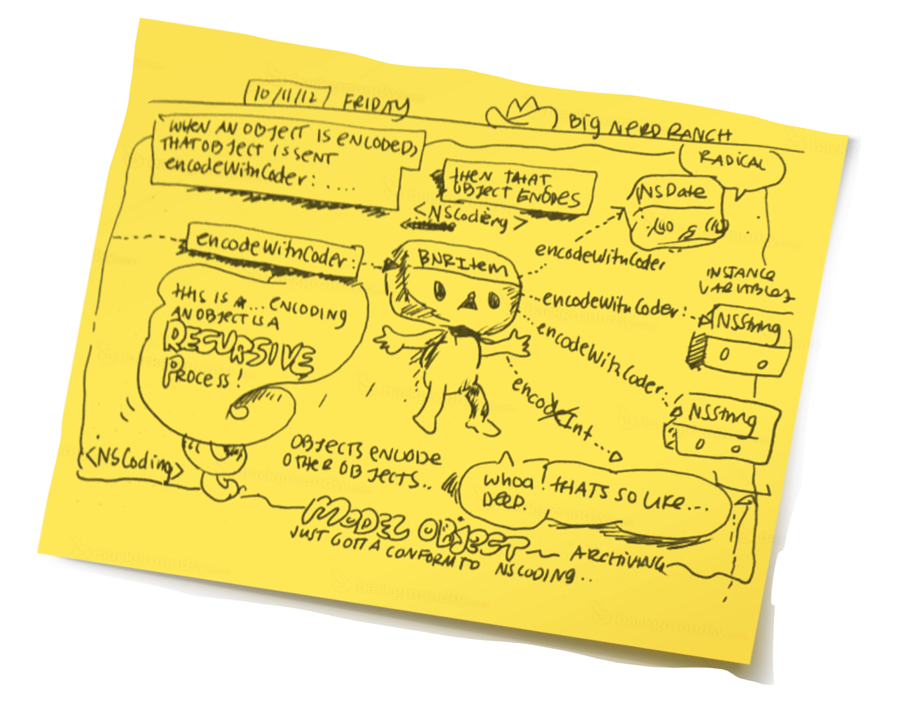

# Comic Nerd iOS Blog

## Overview

Many years ago I learned how to code iOS apps with the help of some great books, teachers and senior developers. 

Many of the best ways of learning were through reading other developers' screencasts and blogs... along with reading the documentation (thanks for nagging me, cranky senior devs!)

Since I'm a cartoonist, it makes sense to make a blog about iOS development.  Maybe there can even be screencasts later. 

Hopefully this will help other people learn too! We're all in it together!

_Notes from Big Nerd Ranch_

